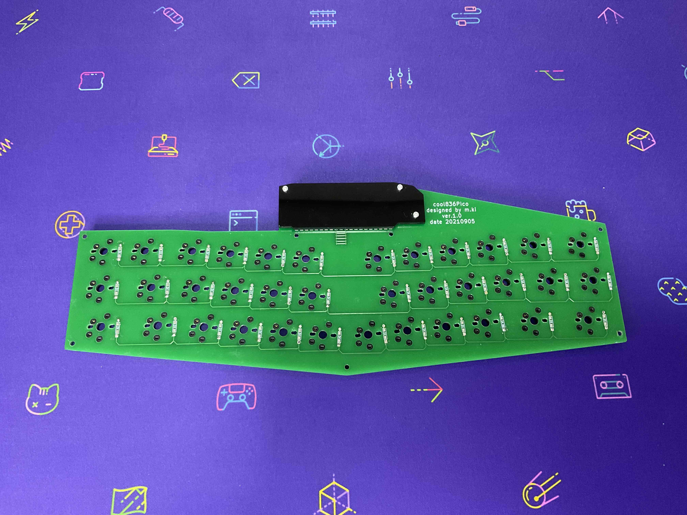

# cool836pico　ビルドガイド

**写真**

cool836pico　chocスイッチ採用

 
 
**特徴**
 
・30％Alice  layout 
・サンドイッチマウント、チルト0〜10度 
・PCB、トッププレート、ボトムプレートそれぞれFR4を使用。 
・36キー（choc、MXソケットによるキースイッチ交換可能） 
 

**同封されている部品**
 
１　PCB　１枚 
２　スイッチプレート　１枚 
３　カバープレート　１枚 
４　ボトムプレート１式（３枚） 
５　スペーサー（M2 3mm）　７本　※１ 
６　スペーサー（M2 6mm）　７本 
※１　chocスイッチ使用の時は、必要ありません。
 

**別途、購入が必要な部品**
 
１　キースイッチ　36個 ※chocまたはMX互換のもの 
２　キーキャップ　36個 ※chocまたはMX互換のもの　※２ 
３　スイッチソケット　36個 
４　ダイオード　36個 
５　ネジ（M2 4mm）　　３本 
６　ネジ（M2 8mm）　　16本　※３ 
７　ナット(M2)　４本
８　raspberry pi pico １個 
９　コンスルー（スプリングピンヘッダ）　１組（２個）※20ピン 
10　クッションゴム　４個 

※２　キーキャップの構成は、1U×32、1.25U×2、1.5U×1、1.75U×1ですが、全て1Uキーでも構いません。 
キーキャップのレジェンド（キーキャップ上面の印字）とキーレイアウトのキーのサイズが一致しません。 
レジェンドよりも使い勝手のよいキーレイアウトを優先しています。 
※３　chocスイッチ使用時は、ネジ（M2 6mm）が７本必要となり、逆にネジ（M2 8mm）は９本必要となります。
 
※別途、必要な部品は、[TALP KEYBOARDs](https://talpkeyboard.stores.jp)さんや[遊舎工房](https://shop.yushakobo.jp)さん等で購入できます。
 

## ファームウェア
 
　このキーボードはkmk_firmwareというキーボード用のソフトウェアで動作するようにプログラミングしています。 

**1 CircuitPythonの導入**
 
KMKを導入する前に，以下の手順でraspberry pi pico（以下、Pico）にCircuitPythonの実行環境を書き込む必要があります。

**ステップ１**
 
CircuitPythonの公式サイトからPico用のCircuitPythonのファームウェアをダウンロードします。
https://circuitpython.org/board/raspberry_pi_pico/

**ステップ２**
 
PicoのBOOTSELボタンを押しながらUSBケーブルを接続し，Picoに対応するドライブにステップ1でダウンロードした.uf2ファイルをドラッグ＆ドロップします。

 

**２　KMK本体のコピー**
 
KMKのCircuitPythonスクリプトはGitHub 上で公開されており，これらのCircuitPythonスクリプトをPicoに書き込むことによってKMKを使用できる状態になります。
 

**ステップ1**
 
以下のKMKのGitHubリポジトリからKMKの本体をダウンロードします．
https://github.com/KMKfw/kmk_firmware/archive/7a30cc8ccea4111d9b953033599f176579b8091b.zip

**ステップ2**
 
ダウンロードしたZipファイルを展開し，中にあるkmkディレクトリをPicoのlibディレクトリの下に丸ごとコピーします。

**３　code.pyの配置**
 
Picoのルート・ディレクトリにcode.pyをコピーします。
[cool836pico用のcode.py](https://github.com/telzo2000/cool836pico/blob/main/code.py)
 
書き込みが完了すると自動的にリセットがかかります。
 

**４キー配列のカスタマイズ**
 
code.pyのkeymap設定部分を書き換えることにより，自分の好きなキー配列に設定できます。
 
詳細は、KMKのドキュメントをお読みください。

 

## 組み立て手順
 

### １　基板の確認

組み立ての前に、PCB、トッププレート、ボトムプレート１式の上・下面を確認します。PCB表面の右上に「cool836Pico」と印刷されています。印刷されている面が、上面となります。
他のプレートはねじ穴位置を合わせて、上面を確認してください。
上・下面が違うと、ネジが正しく入りません。 
 

### ２　ダイオードのハンダ付け
ダイオードは、足のついているもの（リードタイプ）と足のついていないもの（SMD）の２種類が使えます。
 
**chocスイッチ**を使用する場合、SMDタイプのダイオードをお勧めします。
リードタイプですと、トッププレートとPCBの間にハンダが残り、トッププレートが浮いてしまいます。
 
**MXスイッチ**を使用する場合は、どちらのダイオードでも大丈夫です。
ダイオードはPCBの裏面に本体が残るように、ハンダ付けしてください。
ハンダ付けに自信がない場合、フラックスを利用すると、上手にハンダ付けができます。
その後、フラックスクリーナーで綺麗に拭き取ることをお勧めします。
 

### ３ スイッチソケットのハンダ付け
cool836picoは、chocソケットおよびMXソケットに対応しています。
どちらかを選んでつけても良いですし、両方をつけることもできます。
 
ソケットのハンダ付けでは、ソケットの向きに注意してください
ソケットの端子がPCBと接する箇所片方に、予備ハンダをしておくと、ハンダ付けが上手くいきます。
上手くハンダ付けができない場合、フラックスを多めに塗布して行うと、ハンダがソケットの端子とPCBの端子の間に流れていきます。
その後、フラックスクリーナーで綺麗に拭き取ることをお勧めします。

 
ダイオード、chocソケット、MXソケットがハンダ付けされたPCB

　 

### ４　Picoの取り付け
このビルドガイドではコンスルー（スプリングピンヘッダ）を使用して
Picoの装着をしました。
Picoの装着箇所が、PCB下側であるため、時間が経つと、落下する可能性があります。
ボトムプレートがあるので、紛失することはありません。
ハンダ付けによる固定を推奨します。

 
コンスルー（スプリングピンヘッダ）を使用するときは、向きに気をつけて使用してください。
 

### ５　カバープレートの取り付け
カバープレートのそれそれのネジ穴にM2ネジ8mmを通して、反対側でナットで締めます。そのあと、カバープレートをPCB表面に載せます。 
PCBの向きを変えて、裏面からM2スペーサー6mmを２つ、M2ナットを１つで、固定します。
 
上面から

下面から

PCBに載せた上面の様子

PCBに載せた下面の様子

 
　 

### ６a　スイッチプレート、ソケットの取り付け　choc編 
スイッチプレートの上下の向きに注意して、PCB上面に載せて、７箇所にネジ（M2 6mm）を上面から挿しこみ、PCB下面からスペーサー（M2 6mm）で固定します。
 
その後、chocスイッチを挿していきます。スイッチの足が曲がらないように注意してください。

 

### ６b スイッチプレート、ソケットの取り付け　cherryMX編
最初にスイッチプレートのの上下の向きに注意して、上面から７箇所にネジ（M2 8mm）を挿しこみ、下面からスペーサー（M2 3mm）でゆるく固定します。
 
次にキースイッチ５個をスイッチプレートの５箇所（四隅と一番手前）に差し込みます。
一度に全部のキースイッチを取り付けて、その後にPCBにハンダ付けしたMXソケットに差し込むとうまくいかないことが予想されます。
５箇所で一度PCBにハンダ付けしたMXソケットに差し込み、残りのキースイッチをトッププレート、PCBの順に差し込んでください。それぞれのキースイッチの足がきちんとMXソケットの基板の穴に差し込まれていることを確認してください。
差し込むときに、足が曲がってしまうことがあります。
その場合は、ボタンを押しても入力されません。
一度キースイッチを外して、足の修正または新しいキースイッチに交換等対処してください。 
その次に、PCB下面からスペーサー（M2 6mm）で固定します。その後、残りのMXソケットを取り付けてください。
 

### ７　ボトムプレートの取り付け 
ボトムプレート1式は次の３つパーツで構成されています。 
- ボトムプレート大　１枚
- ボトムプレート小　２枚

PCB裏面を上向きにします。そこに、形が揃うように、ボトムプレート大を載せて、３箇所をネジ（M2 4mm）で固定します。
 

PCB裏面が上向きの様子

ボトムプレート大を載せてネジで固定

 
次にボトムプレート小を１・２枚（任意）載せて、６箇所をネジ（M2 8mm）で固定します。

また、ボトムプレート小を使わないと、傾斜のないフラットなキーボードになります。試してみて、最適な角度で使用してください。

 
その後、お好みでクッションゴムを取り付けてください。 
 
組み立ての手順は、以上です。 
 

気に入っていただけたら、幸いです。　 

